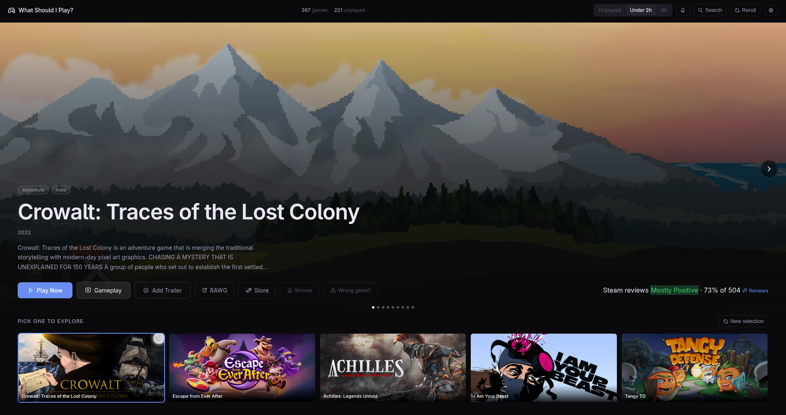
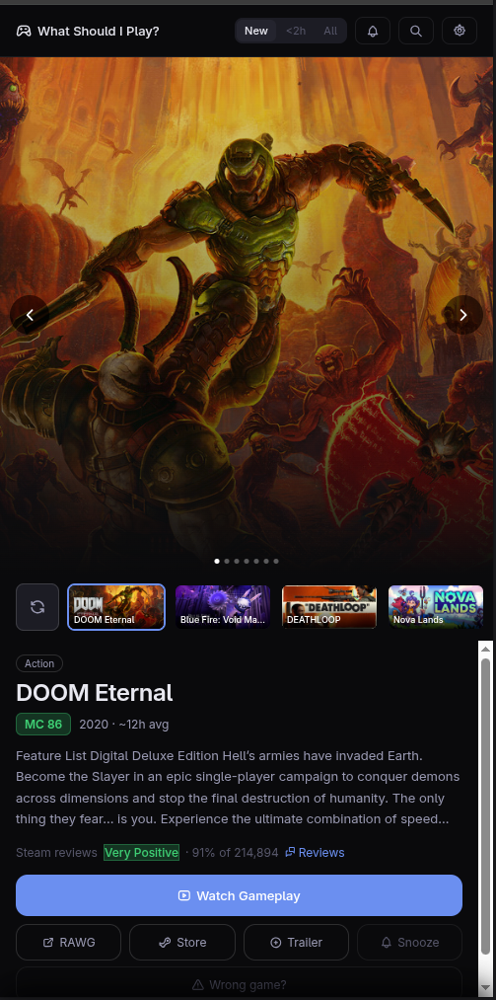
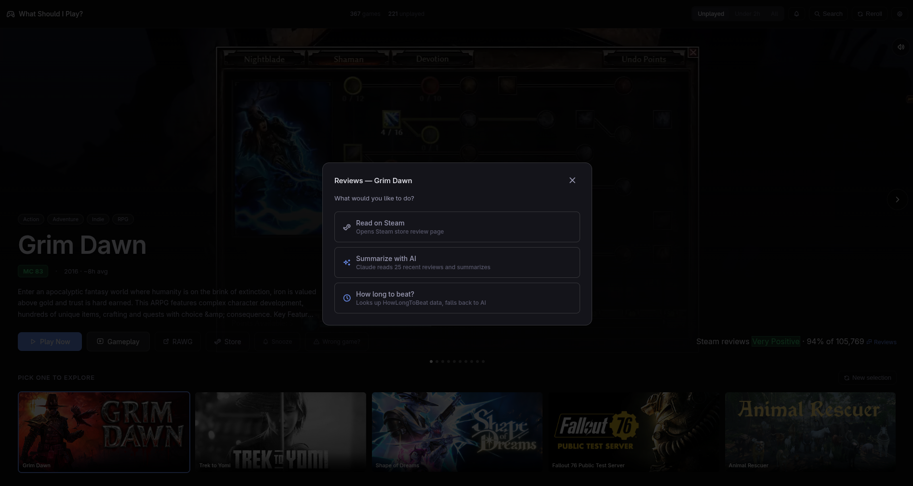
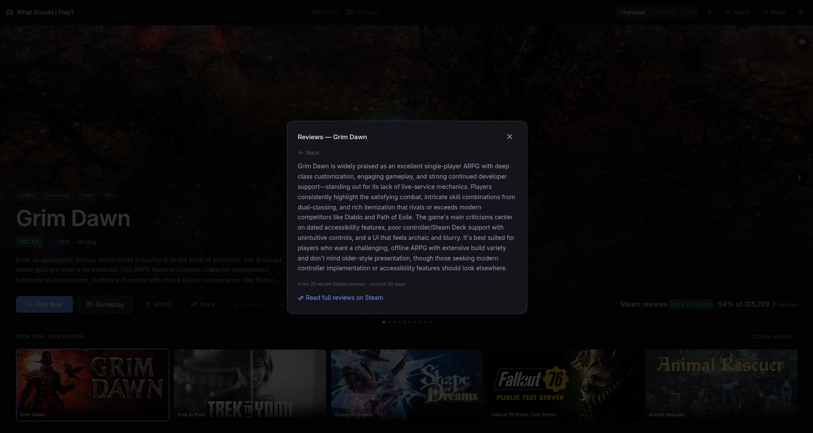
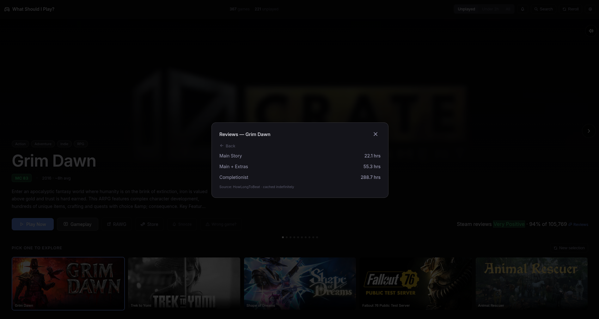

# 🎮 What Should I Play?

A self-hosted Steam backlog browser that helps you decide what to play next. Built with Rust + Axum, served as a single binary with no external dependencies.



---

## Features

- **Cinematic hero UI** — full-screen artwork, trailer autoplay, screenshot slideshow
- **Smart randomization** — randomly picks 5 candidates from your unplayed library
- **Pool modes** — filter by Unplayed, Under 2 Hours, or All games
- **Steam + RAWG** — descriptions and art from Steam, Metacritic scores and trailers from RAWG
- **AI summaries** — Claude Haiku summarizes Steam reviews on demand
- **How long to beat?** — HLTB data via your own binary, falls back to Claude AI web search
- **Snooze / Remind me** — snooze a game for 7/14/30/90 days, bell icon shows when reminders are due
- **YouTube trailers** — add a YouTube trailer for any game, saved permanently
- **Wrong game?** — one-click Steam override when RAWG matches the wrong game
- **Mobile PWA** — full mobile UI, installable as a home screen app
- **Search** — search any Steam game, not just your library
- **SQLite caching** — all metadata cached locally, fast after first load



---

## Screenshots


      |

---

## Requirements

- A [Steam API key](https://steamcommunity.com/dev/apikey)
- A [RAWG API key](https://rawg.io/apidocs) (free)
- An [Anthropic API key](https://console.anthropic.com/) (optional, for AI summaries and playtime)
- Your Steam ID (64-bit)

---

## Installation

### Build from source

```bash
git clone https://github.com/frank-giugliano/what-should-i-play
cd what-should-i-play
cargo build --release
```

The binary will be at `target/release/steam-backlog`.

### Configuration

Copy `config.toml.example` to `config.toml` and fill in your keys:

```toml
STEAM_API_KEY     = "your_steam_api_key"
STEAM_ID          = "your_steam_id_64"
RAWG_API_KEY      = "your_rawg_api_key"
ANTHROPIC_API_KEY = "your_anthropic_api_key"

CACHE_TTL_DAYS          = 7
LIBRARY_CACHE_TTL_HOURS = 24
CACHE_IMAGES            = false
DEBUG                   = false

# Optional: your own HLTB binary
# HLTB_API_URL = "http://localhost:9234"

# Optional: custom port (default 3000)
# PORT = 3000
```

### Run

```bash
./steam-backlog
```

Then open `http://localhost:3000` in your browser.


---

## Optional: HLTB Integration

Supports an optional companion binary for HowLongToBeat data. If you have one running at a local HTTP endpoint that accepts `GET /game?steam_id=APPID`, set `HLTB_API_URL` in your config. If not set, the app falls back to Claude AI web search for playtime estimates.

---

## Tech Stack

- **Backend** — Rust, Axum, SQLite (via rusqlite)
- **Data sources** — Steam Web API, RAWG API, Anthropic API
- **Frontend** — Vanilla HTML/CSS/JS, Tabler Icons
- **Deployment** — Single binary, systemd service


